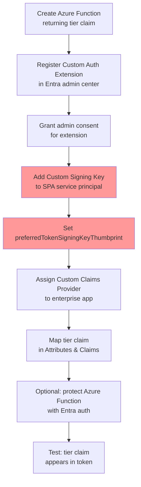

# Tutorial: Add a `custom:tier` Claim via Custom Authentication Extension in Microsoft Entra External ID

## Overview

This tutorial walks through adding a custom `tier` claim to tokens issued by Microsoft Entra External ID (CIAM) using a **Custom Authentication Extension** with the `OnTokenIssuanceStart` event. This replicates the behavior of the Cognito Pre Token Generation Lambda that injected `custom:tier` into tokens.

### The AADSTS50146 Problem

When you add a custom claims provider to your application in an External ID (CIAM) tenant, you will encounter:

> **AADSTS50146**: MissingCustomSigningKey - This app is required to be configured with an app-specific signing key. It's either not configured with one, or the key has expired or isn't yet valid.

**Root cause**: When tokens are augmented with custom claims via a claims mapping policy, Microsoft Entra requires the application to use a custom signing key to prevent token forgery. The `acceptMappedClaims: true` manifest setting is **not safe for multitenant apps** and may not work in External ID tenants. The recommended fix is to configure a **custom signing key** on the app registration's service principal.

### Reference Links

| Topic | Microsoft Learn URL |
|-------|---------------------|
| Create REST API (Azure Function) | https://learn.microsoft.com/en-us/entra/identity-platform/custom-extension-tokenissuancestart-setup |
| Configure Custom Claims Provider | https://learn.microsoft.com/en-us/entra/identity-platform/custom-extension-tokenissuancestart-configuration |
| AADSTS50146 Error Code | https://learn.microsoft.com/en-us/entra/identity-platform/reference-error-codes |
| Configure Custom Signing Key (Graph API) | https://learn.microsoft.com/en-us/graph/application-saml-sso-configure-api#option-2-create-a-custom-signing-certificate |
| Troubleshoot Custom Extensions | https://learn.microsoft.com/en-us/entra/identity-platform/custom-extension-troubleshoot |
| External ID Custom Extensions Concepts | https://learn.microsoft.com/en-us/entra/external-id/customers/concept-custom-extensions |

---

## Architecture

```
User signs in → Entra External ID User Flow → OnTokenIssuanceStart event fires
    → Entra calls your Azure Function REST API
    → Function returns { "tier": "premium" }
    → Entra merges "tier" claim into the token
    → Token returned to SPA/API with custom claim
```

---

## Prerequisites

- Microsoft Entra External ID tenant (CIAM) configured with a sign-up/sign-in user flow
- An app registration (SPA) associated with the user flow
- An Azure subscription for hosting the Azure Function
- Azure CLI or Microsoft Graph Explorer for configuring signing keys
- PowerShell (for generating certificates)

### Project-Specific Values

| Setting | Value |
|---------|-------|
| Tenant ID | `0a3af0e3-416b-4a6b-97e9-cb3a9a094449` |
| Tenant subdomain | `cognitomigration` |
| SPA Client ID | `6d28eafe-06fd-46d7-b04a-3403048dfd1c` |
| API Client ID | `6c959c17-63ba-4477-b66e-928d7d9ba937` |
| CIAM Authority | `https://cognitomigration.ciamlogin.com/` |

---

## Step 1: Build and Deploy the Azure Function from the Real Repo Path

For **Flex Consumption** + **.NET Isolated 8.0**, the portal does not reliably provide a "Create function" authoring flow. Use the local project and deploy a ZIP package.

### 1.1 Use the exact project path in this repository

Root folder for this function implementation:

`packages/backend/src/auth/pretoken-tier-function/`

Files used for repeatable deployment:

- `packages/backend/src/auth/pretoken-tier-function/PretokenTierFunction.cs`
- `packages/backend/src/auth/pretoken-tier-function/pretoken-tier.csproj`
- `packages/backend/src/auth/pretoken-tier-function/host.json`
- `packages/backend/src/auth/pretoken-tier-function/local.settings.json`
- `packages/backend/src/auth/pretoken-tier-function/package-for-upload.ps1`

### 1.2 Build the deployment ZIP

From repo root, run:

```powershell
cd packages/backend/src/auth/pretoken-tier-function
.\package-for-upload.ps1
```

Expected ZIP output path:

`packages/backend/src/auth/pretoken-tier-function/pretoken-tier.zip`

### 1.3 Upload in Azure Deployment Center (the path that works)

1. Azure Portal → Function App `pretoken-tier` → **Deployment Center**
2. Source: **Publish files (new)**
3. Upload: `pretoken-tier.zip`
4. Click **Save** and wait for deployment completion

### 1.4 Verify deployment and copy function URL

1. In Function App overview, verify function `pretoken-tier` appears and is **Enabled**
2. Open function `pretoken-tier` → **Get function URL**
3. Copy the URL including `code=...` (function key)

---

## Step 2: Register the Custom Authentication Extension

1. Sign in to the **Microsoft Entra admin center** (https://entra.microsoft.com)
2. Go to **Enterprise applications** → **Custom authentication extensions** → **Create a custom extension**
3. In **Basics**:
   - Event type: **TokenIssuanceStart**
   - Click **Next**
4. In **Endpoint Configuration**:
   - Name: `Tier Claim Extension`
   - Target URL: *(paste your Azure Function URL from Step 1.4)*
   - Description: `Returns tier claim for token enrichment`
   - Click **Next**
5. In **API Authentication**:
   - Select **Create new app registration**
   - Name: `Azure Functions Tier Auth API`
   - Click **Next**
6. In **Claims**, add:
   - `tier`
   - `CorrelationId`
7. Click **Next** → **Create**

### 2.1 Grant Admin Consent

1. Open the newly created custom authentication extension
2. Under **API Authentication**, click **Grant permission**
3. Sign in and **Accept** the permissions

---

## Step 3: Configure the Custom Signing Key (Fix AADSTS50146)

This is the critical step that resolves the AADSTS50146 error. You must add a custom signing key to the **service principal** of your SPA app registration.

Official Microsoft Learn documentation for this step:

- Configure app-specific signing key with Microsoft Graph (Option 2): https://learn.microsoft.com/en-us/graph/application-saml-sso-configure-api#option-2-create-a-custom-signing-certificate
- AADSTS50146 reference (MissingCustomSigningKey): https://learn.microsoft.com/en-us/entra/identity-platform/reference-error-codes
- Custom extension troubleshooting guide: https://learn.microsoft.com/en-us/entra/identity-platform/custom-extension-troubleshoot

### Option A: Using `addTokenSigningCertificate` (Recommended - Simplest)

This method generates a self-signed certificate directly on the service principal via Microsoft Graph. This is the method that was successfully executed for this project.

#### 3A.1 Authenticate to the External ID tenant

Because an External ID tenant may not have Azure subscriptions, standard `az login` can fail with `No subscriptions found`. Use:

```powershell
az login --use-device-code --tenant 0a3af0e3-416b-4a6b-97e9-cb3a9a094449 --allow-no-subscriptions
```

After login completes, verify tenant context:

```powershell
az account show
```

Expected tenant ID:

```text
0a3af0e3-416b-4a6b-97e9-cb3a9a094449
```

#### 3A.2 Resolve the SPA service principal

Use the SPA app ID to get the service principal object ID:

```powershell
az ad sp show --id 6d28eafe-06fd-46d7-b04a-3403048dfd1c
```

For this project, the service principal resolved to:

```text
App ID: 6d28eafe-06fd-46d7-b04a-3403048dfd1c
Display name: cognito-migration-spa
Service principal ID: 80ccb07b-43d5-4063-a67d-672616026aeb
```

#### 3A.3 Create the token signing certificate

The most reliable approach was a direct PowerShell call to Microsoft Graph using the Azure CLI Graph token.

```powershell
$spId = '80ccb07b-43d5-4063-a67d-672616026aeb'
$token = az account get-access-token --resource-type ms-graph --query accessToken -o tsv
$headers = @{ Authorization = "Bearer $token"; 'Content-Type' = 'application/json' }
$body = @{ displayName = 'CN=CognitoMigrationSPA'; endDateTime = '2028-05-07T00:00:00Z' } | ConvertTo-Json -Compress

$result = Invoke-RestMethod -Method Post -Uri "https://graph.microsoft.com/v1.0/servicePrincipals/$spId/addTokenSigningCertificate" -Headers $headers -Body $body
$result | Select-Object thumbprint,keyId,displayName,startDateTime,endDateTime
```

For this project, Graph returned:

```text
thumbprint   : CE325517435096D82335F0D0D101DF10F6996183
keyId        : 2de1f0f5-f6ac-4b09-be8d-ec22d0826648
displayName  : CN=CognitoMigrationSPA
```

#### 3A.4 Activate the signing key

Set the `preferredTokenSigningKeyThumbprint` on the same service principal:

```powershell
$spId = '80ccb07b-43d5-4063-a67d-672616026aeb'
$thumb = 'CE325517435096D82335F0D0D101DF10F6996183'
$token = az account get-access-token --resource-type ms-graph --query accessToken -o tsv
$headers = @{ Authorization = "Bearer $token"; 'Content-Type' = 'application/json' }
$body = @{ preferredTokenSigningKeyThumbprint = $thumb } | ConvertTo-Json -Compress

Invoke-RestMethod -Method Patch -Uri "https://graph.microsoft.com/v1.0/servicePrincipals/$spId" -Headers $headers -Body $body
```

#### 3A.5 Verify the configuration

```powershell
$sp = az ad sp show --id 6d28eafe-06fd-46d7-b04a-3403048dfd1c | ConvertFrom-Json
[pscustomobject]@{
    id = $sp.id
    displayName = $sp.displayName
    preferredTokenSigningKeyThumbprint = $sp.preferredTokenSigningKeyThumbprint
    keyCredentialCount = $sp.keyCredentials.Count
}
```

Expected result:

```text
preferredTokenSigningKeyThumbprint = CE325517435096D82335F0D0D101DF10F6996183
keyCredentialCount = 2
```

#### 3A.6 Notes from the actual execution

- The signing key must be configured on the **service principal**, not only on the app registration object.
- `az rest` was unreliable here for JSON body submission in PowerShell; `Invoke-RestMethod` with a Graph bearer token worked consistently.
- `--allow-no-subscriptions` was required because this CIAM tenant is tenant-level only and does not expose Azure subscriptions.
- After this step completed, the SPA service principal had a non-null `preferredTokenSigningKeyThumbprint`, which is the required precondition for avoiding AADSTS50146.

### Option B: Using a Custom Certificate (PowerShell + Graph API)

If you need to use your own certificate (e.g., from a CA):

#### 3B.1 Generate a Self-Signed Certificate

```powershell
$cert = New-SelfSignedCertificate `
    -CertStoreLocation "cert:\CurrentUser\My" `
    -DnsName "CN=CognitoMigrationSPA" `
    -NotAfter (Get-Date).AddYears(3)

$pwd = ConvertTo-SecureString -String "YourPassword123!" -Force -AsPlainText
$pfxPath = ".\CognitoMigrationSPA.pfx"
$cerPath = ".\CognitoMigrationSPA.cer"

Export-PfxCertificate -Cert "cert:\CurrentUser\My\$($cert.Thumbprint)" -FilePath $pfxPath -Password $pwd
Export-Certificate -Cert "cert:\CurrentUser\My\$($cert.Thumbprint)" -FilePath $cerPath

# Get the base64 key
$certKey = [convert]::ToBase64String((Get-Content $cerPath -AsByteStream -Raw))
$thumbprint = $cert.Thumbprint

Write-Host "Thumbprint: $thumbprint"
Write-Host "Key (first 50 chars): $($certKey.Substring(0, 50))..."
```

#### 3B.2 Upload the Key to the Service Principal

```http
PATCH https://graph.microsoft.com/v1.0/servicePrincipals/{servicePrincipalId}
Content-type: application/json

{
    "keyCredentials": [
        {
            "customKeyIdentifier": "{thumbprint}",
            "endDateTime": "2027-01-01T00:00:00Z",
            "keyId": "{generate-a-new-GUID}",
            "startDateTime": "2025-01-01T00:00:00Z",
            "type": "X509CertAndPassword",
            "usage": "Sign",
            "key": "{base64-encoded-pfx}",
            "displayName": "CN=CognitoMigrationSPA"
        },
        {
            "customKeyIdentifier": "{thumbprint}",
            "endDateTime": "2027-01-01T00:00:00Z",
            "keyId": "{generate-another-GUID}",
            "startDateTime": "2025-01-01T00:00:00Z",
            "type": "AsymmetricX509Cert",
            "usage": "Verify",
            "key": "{base64-encoded-cer}",
            "displayName": "CN=CognitoMigrationSPA"
        }
    ],
    "passwordCredentials": [
        {
            "customKeyIdentifier": "{thumbprint}",
            "keyId": "{same-keyId-as-X509CertAndPassword}",
            "endDateTime": "2027-01-01T00:00:00Z",
            "startDateTime": "2025-01-01T00:00:00Z",
            "secretText": "YourPassword123!"
        }
    ]
}
```

#### 3B.3 Activate the Signing Key

```http
PATCH https://graph.microsoft.com/v1.0/servicePrincipals/{servicePrincipalId}
Content-type: application/json

{
    "preferredTokenSigningKeyThumbprint": "{thumbprint}"
}
```

### Alternative: `acceptMappedClaims` (NOT recommended for External ID)

For **single-tenant workforce** apps only, you can set `acceptMappedClaims: true` in the app manifest:

```json
{
    "acceptMappedClaims": true,
    "requestedAccessTokenVersion": 2
}
```

> ⚠️ **WARNING**: Microsoft docs explicitly state: *"Do not set `acceptMappedClaims` property to `true` for multitenant apps, which can allow malicious actors to create claims-mapping policies for your app."* For External ID (CIAM) tenants, use the custom signing key approach instead.

---

## Step 4: Assign the Custom Claims Provider to Your App

### 4.1 For ID Token (SPA Registration)

1. Go to **Entra admin center** → **Enterprise applications** → Find **cognito-migration-spa**
2. Under **Manage** → **Single sign-on**
3. Under **Attributes & Claims** → **Edit**
4. Expand **Advanced settings**
5. Next to **Custom claims provider** → **Configure**
6. Select **Tier Claim Extension** from the dropdown
7. Click **Save**

### 4.2 Add the Claim Mapping

1. Click **Add new claim**
2. Name: `tier`
3. Source: **Attribute**
4. Source attribute: `customClaimsProvider.tier`
5. Click **Save**

### 4.3 For Access Token (API Registration)

Repeat steps 4.1–4.2 for the **cognito-migration-api** enterprise app if you need the `tier` claim in access tokens.

Important:

- If the custom claims provider is assigned to the API app, the API service principal also needs its own app-specific signing key.
- For this project, the API app `6c959c17-63ba-4477-b66e-928d7d9ba937` required the same Step 3 fix.
- API service principal used in this tenant: `d9b212cf-0aec-41dc-ab19-3b0c1ccbb20c`
- Configured API signing thumbprint: `8BCBF8E3AC7DFAFA540A2464033A5A7773DE9B3D`

If you only want `tier` in the ID token, assign the custom claims provider only to the SPA app.

---

## Step 5: Protect the Azure Function

This step is recommended for production, but can be skipped for a short-lived demo if your custom authentication extension target URL already includes the Azure Function key.

### Demo mode

For this project, Step 5 can be skipped temporarily for demo/testing because:

- the deployed function responds correctly with the function key in the URL
- the custom authentication extension can call that URL directly
- this was sufficient to validate the token enrichment flow

Tradeoff:

- skipping Step 5 leaves the function protected only by the function key
- this is acceptable for a demo, but should not be the final production setup

If you skip Step 5 for a demo, rotate the function key afterward.

### Production mode

1. In **Azure Portal** → your Function App → **Settings** → **Authentication**
2. Click **Add Identity provider**
3. Select **Microsoft** as the identity provider
4. Tenant type: **External configuration**
5. App registration type: **Provide the details of an existing app registration**
6. Client ID: *(the App ID of `Azure Functions Tier Auth API` created in Step 2)*
7. Issuer URL: `https://cognitomigration.ciamlogin.com/0a3af0e3-416b-4a6b-97e9-cb3a9a094449/v2.0`
8. Client application requirement: **Allow requests from specific client applications** → enter `99045fe1-7639-4a75-9d4a-577b6ca3810f`
9. Tenant requirement: **Allow requests from specific tenants** → enter `0a3af0e3-416b-4a6b-97e9-cb3a9a094449`
10. Unauthenticated requests: **HTTP 401 Unauthorized**
11. Uncheck **Token store**
12. Click **Add**

---

## Step 6: Current Portal Behavior for TokenIssuanceStart

The **User flows → Custom authentication extensions** page in External ID does **not** currently expose `OnTokenIssuanceStart`.

That page is for these event types only:

- Before collecting information from the user
- When a user submits their information

For a **TokenIssuanceStart** extension like this one, there is no separate user-flow assignment step in the current portal UI.

What you need instead is already covered in earlier steps:

1. Register the custom authentication extension in **Enterprise applications → Custom authentication extensions**
2. Grant admin consent
3. Configure the signing key on the SPA service principal
4. Assign the custom claims provider to the target app in **Enterprise applications → Single sign-on → Attributes & Claims**
5. Map the claim, for example `tier -> customClaimsProvider.tier`

If those steps are complete, the token issuance extension is effectively wired for that app.

### What to do on the screen you opened

You do not need to configure anything on that **User flows → Custom authentication extensions** page for this `tier` claim scenario.

If you are on that page and only see:

- None selected under **Before collecting information from the user**
- None selected under **When a user submits their information**

that is expected and not a blocker for `TokenIssuanceStart`.

---

## Step 7: Test the Custom Claim

### 7.1 Quick Test with jwt.ms

Open a private browser and navigate to:

```
https://cognitomigration.ciamlogin.com/0a3af0e3-416b-4a6b-97e9-cb3a9a094449/oauth2/v2.0/authorize?client_id=6d28eafe-06fd-46d7-b04a-3403048dfd1c&response_type=id_token&redirect_uri=https://jwt.ms&scope=openid&state=12345&nonce=12345
```

> Note: For this test, you'd need to temporarily add `https://jwt.ms` as a redirect URI in the SPA app registration and enable implicit flow for ID tokens.

After signing in, check the decoded token at jwt.ms for the `tier` claim.

### 7.2 Test with the Application

1. Start the frontend: `cd packages/frontend && npm run dev`
2. Start the backend: `cd packages/backend && npm run start:dev`
3. Sign in via the app at `http://localhost:5173`
4. Check the API response from `/api/profile` — the `tier` field should now be `"premium"`

---

## Troubleshooting

### AADSTS50146 Still Occurring

- Verify the signing key is on the **service principal** (not just the app registration)
- Confirm `preferredTokenSigningKeyThumbprint` is set correctly
- If the custom claims provider is assigned to both the SPA and API apps, verify **both** service principals have signing keys
- Wait a few minutes after configuration for propagation
- Check the certificate hasn't expired

### Extension Not Being Called

- Check the Azure Function's **Monitor** tab for invocation logs
- Verify admin consent was granted (Step 2.1)
- Check sign-in logs in Entra: **Enterprise apps** → **Sign-in logs** → **Authentication Events** tab
- Verify the custom claims provider is assigned on the enterprise app under **Single sign-on → Attributes & Claims**
- The **User flows → Custom authentication extensions** page is not used for `TokenIssuanceStart`

### Custom Claims Not in Token

- Verify the claim mapping is configured (Step 4.2)
- Check that the custom claims provider is assigned to the correct enterprise app
- For access tokens, the claims provider must be on the **resource** (API) app
- For ID tokens, it must be on the **client** (SPA) app
- If access tokens still fail with AADSTS50146, the API service principal likely still needs its own signing key

### Error Codes from Custom Extension

| Code | Meaning |
|------|---------|
| 1003005 | Function timed out (must respond within 2 seconds) |
| 1003002 | Function returned non-200 status |
| 1003003 | Response body doesn't match expected schema |
| 1003021 | Missing admin consent for `CustomAuthenticationExtensions.Receive.Payload` |

### Performance Tips

- Use Azure Functions **Premium** or **Dedicated** plan to avoid cold starts
- Cache downstream API calls
- Keep the function execution under 2 seconds

---

## Summary of Steps to Resolve AADSTS50146



*Steps D and E (highlighted) are what resolve the AADSTS50146 error.*

---

## Next Steps After Completing This Tutorial

- Update backend to read `tier` from tokens (already implemented in `app.controller.ts`)
- Display tier info in frontend UI (already implemented in `ProfilePage.tsx`)
- Consider using the extension to return different tier values based on user attributes or an external database lookup
- If you used demo mode and skipped Step 5, rotate the Azure Function key afterward
- Mark Task 11 as ✅ COMPLETE in the engineering tasks document
